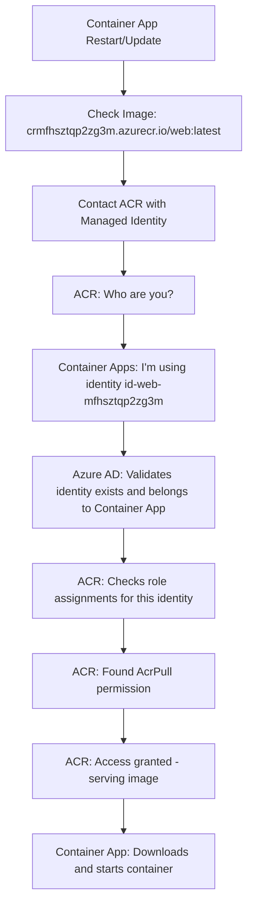

# Azure Container Apps Authentication & Deployment Flow

This document explains how Azure Container Apps, Managed Identities, and Azure Container Registry work together to provide secure, passwordless container deployment.

## 🏗️ Overview

The FastAPI TDD Docker project uses Azure's managed identity system to securely pull container images from Azure Container Registry (ACR) without storing any passwords or credentials in code.

## 🔐 Key Security Components

### 1. Managed Identity

- **Type**: User-Assigned Managed Identity
- **Purpose**: Provides an automatic identity for the Container App
- **Benefits**: No credential management, automatic rotation, Azure-managed security

### 2. Azure Container Registry (ACR)

- **Purpose**: Private container image storage
- **Security**: Only accessible with proper authentication
- **Integration**: Seamless integration with Azure services via managed identities

### 3. Role-Based Access Control (RBAC)

- **Role**: AcrPull (`7f951dda-4ed3-4680-a7ca-43fe172d538d`)
- **Permission**: Allows pulling (downloading) container images
- **Scope**: Limited to specific Container Registry

## 🔄 Infrastructure Creation Flow

### Step 1: Dependency Resolution

Even though modules are defined in this order in `main.bicep`:

```
1. web module (line 30)
2. database module (line 42)
3. containerApps module (line 60)
```

Bicep analyzes dependencies and executes in this order:

```
1. monitoring (creates Log Analytics)
2. containerApps (creates ACR + Environment)
3. web + database (parallel, both depend on containerApps)
```

### Step 2: Resource Creation Sequence

#### 2.1 Container Apps Environment & Registry

```bicep
// infra/core/host/container-apps.bicep
resource containerRegistry 'Microsoft.ContainerRegistry/registries@2023-01-01-preview' = {
  name: containerRegistryName  // crmfhsztqp2zg3m
  sku: { name: 'Basic' }
  properties: { adminUserEnabled: true }
}

resource containerAppsEnvironment 'Microsoft.App/managedEnvironments@2023-05-01' = {
  name: containerAppsEnvironmentName  // cae-mfhsztqp2zg3m
  // ... configuration
}
```

#### 2.2 Web Service Identity Creation

```bicep
// infra/app/web.bicep
resource webIdentity 'Microsoft.ManagedIdentity/userAssignedIdentities@2023-01-31' = {
  name: identityName  // id-web-mfhsztqp2zg3m
  location: location
}
```

#### 2.3 Container App Creation

```bicep
// infra/core/host/container-app.bicep
resource containerApp 'Microsoft.App/containerApps@2023-05-01' = {
  identity: {
    type: 'UserAssigned'
    userAssignedIdentities: { '${userIdentity.id}': {} }
  }
  properties: {
    configuration: {
      registries: [
        {
          server: containerRegistry.properties.loginServer
          identity: userIdentity.id  // 🔑 Key connection!
        }
      ]
    }
  }
}
```

#### 2.4 Permission Grant

```bicep
// infra/core/host/container-app.bicep
resource containerRegistryRoleAssignment 'Microsoft.Authorization/roleAssignments@2022-04-01' = {
  scope: containerRegistry
  name: guid(subscription().id, resourceGroup().id, userIdentity.id, 'acrpull')
  properties: {
    roleDefinitionId: subscriptionResourceId('Microsoft.Authorization/roleDefinitions', '7f951dda-4ed3-4680-a7ca-43fe172d538d')
    principalType: 'ServicePrincipal'
    principalId: userIdentity.properties.principalId
  }
}
```

## 🚀 Deployment & Authentication Flow

### Phase 1: Infrastructure Provisioning (`azd provision`)

1. **Resource Group** created
2. **Container Registry** created (empty)
3. **Container Apps Environment** created
4. **Managed Identities** created for web and database services
5. **Role Assignments** grant AcrPull permissions
6. **Container Apps** created with placeholder images

### Phase 2: Application Packaging (`azd package`)

1. **Docker Build**: `azd` builds `Dockerfile.prod`
2. **Image Tagging**: Tags as `crmfhsztqp2zg3m.azurecr.io/web:latest`
3. **Registry Authentication**: `azd` authenticates with ACR using your Azure credentials
4. **Image Push**: Pushes built image to ACR

### Phase 3: Application Deployment (`azd deploy`)

1. **Container App Update**: Updates Container App configuration to use new image
2. **Image Pull Request**: Container Apps needs to pull the new image
3. **Authentication Flow** (detailed below)
4. **Container Startup**: New container starts with updated image

## 🔐 Runtime Authentication Flow

When Container Apps needs to pull an image, this secure flow occurs:



### Detailed Authentication Steps

1. **Identity Presentation**

   - Container Apps service presents the managed identity to ACR
   - No passwords or keys involved

2. **Azure AD Validation**

   - Azure Active Directory confirms the identity is valid
   - Verifies the identity belongs to the requesting Container App

3. **Permission Check**

   - ACR checks role assignments for the identity
   - Finds AcrPull role assignment created by Bicep

4. **Access Grant**
   - ACR grants access to pull the specific image
   - Image is downloaded and container starts

## 🎯 Security Benefits

### No Stored Credentials

- **No passwords** in configuration files
- **No API keys** in environment variables
- **No secrets** in source control

### Automatic Credential Management

- **Azure manages** all authentication tokens
- **Automatic rotation** of underlying credentials
- **Secure communication** between Azure services

### Principle of Least Privilege

- **Specific permissions**: Only AcrPull, not full ACR access
- **Scoped access**: Only to the specific Container Registry
- **Service isolation**: Each service has its own identity

### Deterministic Security

- **Predictable role names**: Using `guid()` function ensures consistent role assignment names
- **Reproducible deployments**: Same infrastructure every time
- **Audit trail**: All permissions defined in Infrastructure as Code

## 🏷️ Resource Naming Patterns

### GUID Generation for Role Assignments

```bicep
name: guid(subscription().id, resourceGroup().id, userIdentity.id, 'acrpull')
```

**Inputs:**

- `subscription().id`: Scopes to subscription
- `resourceGroup().id`: Scopes to resource group
- `userIdentity.id`: Unique per identity
- `'acrpull'`: Human-readable hint for role type

**Output:** Deterministic GUID like `7b3d4e5-1234-5678-9abc-def012345678`

**Benefits:**

- **Unique**: No naming conflicts
- **Deterministic**: Same inputs = same GUID
- **Self-documenting**: 'acrpull' hint in source code

## 🔍 Troubleshooting Authentication Issues

### Common Problems and Solutions

1. **Container App can't pull images**

   - Check role assignment exists
   - Verify managed identity is assigned to Container App
   - Confirm ACR registry URL is correct

2. **Permission denied errors**

   - Verify AcrPull role is assigned (not AcrPush or other role)
   - Check role assignment scope matches the Container Registry
   - Ensure principal ID matches the managed identity

3. **Image not found**
   - Verify image exists in ACR: `az acr repository show-tags --name <registry> --repository <image>`
   - Check image naming and tagging in deployment

### Diagnostic Commands

```bash
# List role assignments for Container Registry
az role assignment list --scope "/subscriptions/<sub-id>/resourceGroups/<rg>/providers/Microsoft.ContainerRegistry/registries/<registry-name>"

# Check managed identity details
az identity show --name <identity-name> --resource-group <rg>

# List Container App configuration
az containerapp show --name <app-name> --resource-group <rg>
```

## 📚 Azure Built-in Role Reference

Common Azure Container Registry roles:

| Role Name | Role ID                                | Permissions                 |
| --------- | -------------------------------------- | --------------------------- |
| AcrPull   | `7f951dda-4ed3-4680-a7ca-43fe172d538d` | Pull images from registry   |
| AcrPush   | `8311e382-0749-4cb8-b61a-304f252e45ec` | Push and pull images        |
| AcrDelete | `c2f4ef07-c644-48eb-af81-4b1b4947fb11` | Delete images from registry |
| Owner     | `8e3af657-a8ff-443c-a75c-2fe8c4bcb635` | Full access to registry     |

## 🚀 Best Practices

### Security

1. **Use managed identities** instead of service principals when possible
2. **Grant minimal permissions** (AcrPull instead of Owner)
3. **Use user-assigned identities** for shared resources
4. **Audit role assignments** regularly

### Infrastructure as Code

1. **Use deterministic naming** with `guid()` function
2. **Document role purposes** with descriptive strings in GUID generation
3. **Separate identity creation** from identity usage (reusability)
4. **Use `existing` keyword** when referencing resources created elsewhere

### Deployment

1. **Test authentication** in non-production environments first
2. **Monitor deployment logs** for authentication errors
3. **Use Azure CLI** for troubleshooting and verification
4. **Implement proper dependency ordering** in Bicep templates

## 🎓 Key Takeaways

1. **No Passwords Required**: Managed identities eliminate credential management
2. **Automatic Security**: Azure handles authentication token lifecycle
3. **Infrastructure as Code**: All permissions defined and versioned in Bicep
4. **Enterprise Ready**: Same security patterns used by large organizations
5. **Deterministic Deployments**: Predictable and reproducible infrastructure

This authentication flow represents modern cloud security best practices, providing robust security while maintaining developer productivity and operational simplicity.
